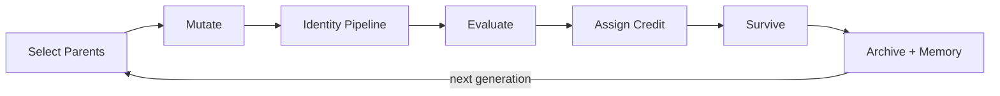
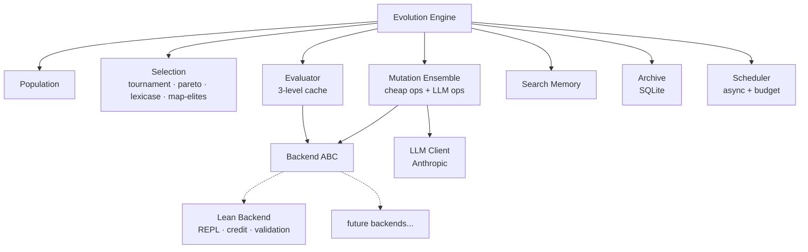

# evoforge

Evolutionary engine for formally-grounded symbolic expressions.
Uses LLMs for mutation, formal systems for fitness.

## How it works



## Architecture



## Quick start

```bash
uv sync --dev
uv run pytest -x -v
```

## Project structure

```
evoforge/
  core/       — engine, types, selection, mutation, archive, evaluator, memory, scheduler
  backends/   — pluggable domain backends (lean, ...)
  llm/        — LLM client and operators
tests/
configs/
scripts/
```

## Status

- Core framework: implemented
- Lean 4 backend: implemented
- 337 tests, strict mypy, ruff

## Running with Lean

Requires a sibling [LeanLevy](https://github.com/slink/LeanLevy) project with the REPL built:

```bash
# Build REPL in LeanLevy (sibling directory)
cd ../LeanLevy
lake update && lake build repl
cd ../evoforge

# Run (project dir comes from backend.project_dir in the config file)
uv run python scripts/run.py --config configs/lean_default.toml --max-generations 3

# Or override with env var
LEAN_PROJECT_DIR=/other/path/to/LeanLevy uv run python scripts/run.py --config configs/lean_default.toml --max-generations 3
```
