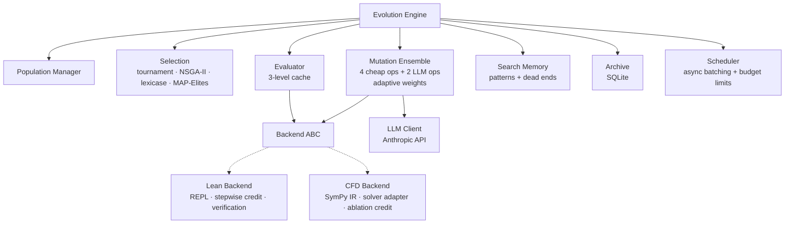

# evoforge

An evolutionary engine for formally-grounded symbolic expressions. It uses LLMs to suggest mutations and formal verification systems to evaluate fitness. Two backends: Lean 4 theorem proving (on hold) and CFD turbulence closure optimization (active).

The idea: instead of asking an LLM to produce a complete proof in one shot, treat proof construction as a search problem. Maintain a population of partial proof attempts, evolve them over generations using both cheap syntactic operators and LLM-guided mutations, and let the formal verifier be the sole judge of progress.

This is a research project. It works end-to-end but has not yet produced a novel proof.

## How it works


Each generation:

1. **Select** parents from the population (tournament, NSGA-II, lexicase, or MAP-Elites)
2. **Mutate** using a weighted ensemble of cheap syntactic operators and LLM-guided operators
3. **Deduplicate** via an identity pipeline (canonicalize, hash, reject duplicates)
4. **Evaluate** against the formal backend — for Lean, this means stepping through each tactic in the REPL and measuring how many goals are closed
5. **Assign credit** per-step so partial proofs get meaningful fitness scores
6. **Survive** — selection pressure culls the population
7. **Archive** results to SQLite; update search memory (working patterns, dead ends)

Periodically, the engine also:
- Asks the LLM to **reflect** on what's working and what isn't, feeding insights back into search memory
- Runs **best-first tree search** from promising partial proofs, expanding one tactic at a time
- **Checkpoints** all state for crash recovery

## Architecture



### Key components

- **Engine** (`evoforge/core/engine.py`) — the main loop. Wires everything together, manages lifecycle, handles checkpointing and resume.
- **Backend ABC** (`evoforge/backends/base.py`) — interface that any formal system must implement: seed population, evaluate, format prompts, assign credit.
- **Lean backend** (`evoforge/backends/lean/`) — talks to Lean 4 via a REPL subprocess over a pty. Evaluates proofs step-by-step, runs two-tier verification (REPL cmd check, then `lake env lean` for full kernel verification), extracts available API from source files. Currently on hold.
- **CFD backend** (`evoforge/backends/cfd/`) — evolves turbulence closure functions (SymPy expressions) for RANS solvers. Evaluates by monkey-patching the damping function into a 1D flow solver and comparing predicted friction factors against Jensen et al. (1989) experimental data. Uses ablation-based credit assignment and three cheap operators (constant perturbation, subtree mutation, term add/remove).
- **Mutation ensemble** (`evoforge/core/mutation.py`) — cheap operators (swap steps, truncate, splice prefixes, reorder) plus LLM-guided mutation and crossover. Weights adapt based on which operators are producing fitness improvements.
- **Selection** (`evoforge/core/selection.py`) — four strategies. Lexicase is the default and tends to maintain more diversity than tournament.
- **Search memory** (`evoforge/core/memory.py`) — tracks patterns that led to fitness gains and dead ends to avoid. Fed into LLM prompts so the model learns from the population's history.
- **Tree search** (`evoforge/backends/lean/tree_search.py`) — best-first search over REPL proof states. Used as a refinement step on promising partial proofs found by evolution.
- **LLM client** (`evoforge/llm/client.py`) — Anthropic API wrapper with exponential backoff, budget tracking, and graceful degradation (if calls fail, cheap operators fill in).

### Proof verification

Verification is three-tiered, from fast to authoritative:

1. **REPL step-by-step** (~ms per step) — walks through each tactic, measures goal closure. This is the primary fitness signal.
2. **REPL cmd** (~100ms) — sends the complete proof as a single `example` command. Catches false positives where individual tactics succeed interactively but the assembled proof is rejected.
3. **`lake env lean`** (~8s) — full kernel elaboration. Only run on proofs that pass tier 2. This is the final gate.

## Project structure

```
evoforge/
  core/       — engine, types, config, selection, mutation, archive,
                evaluator, memory, population, scheduler, identity
  backends/   — pluggable backends
    lean/     — Lean 4 REPL integration, credit assignment, verification,
                tree search, tactic generation, API extraction (on hold)
    cfd/      — CFD turbulence closure optimization: SymPy IR, solver adapter,
                ablation credit, expression mutation operators
  llm/        — Anthropic client, LLM mutation/crossover operators,
                Jinja2 prompt templates
tests/        — 652 tests, strict mypy, ruff
configs/      — TOML experiment configs
scripts/      — CLI entry point (run.py)
```

## Quick start

```bash
# Install dependencies
uv sync --dev

# Run tests (no Lean installation needed — REPL tests are mocked)
uv run pytest -x -v

# Lint + type check
uv run ruff check . && uv run mypy evoforge/
```

## Running with Lean

Requires a Lean 4 project with the [REPL](https://github.com/leanprover-community/repl) package built. The default config targets [LeanLevy](https://github.com/slink/LeanLevy) as a sibling directory.

```bash
# Build REPL in LeanLevy (sibling directory)
cd ../LeanLevy
lake update && lake build repl
cd ../evoforge

# Run evolution (project dir comes from backend.project_dir in config)
uv run python scripts/run.py --config configs/lean_default.toml --max-generations 50

# Override project dir with env var
LEAN_PROJECT_DIR=/path/to/LeanLevy uv run python scripts/run.py --config configs/lean_default.toml

# With output directory and final verification
uv run python scripts/run.py --config configs/lean_default.toml \
  --max-generations 50 --output-dir runs/exp1 --verify

# Resume from checkpoint after crash or interruption
uv run python scripts/run.py --config configs/lean_default.toml \
  --output-dir runs/exp1 --resume
```

Requires `ANTHROPIC_API_KEY` in your environment for LLM-guided mutations. Without it, the engine falls back to cheap operators only.

## Configuration

Experiments are configured via TOML files. See `configs/lean_default.toml` for a complete example. Key sections:

| Section | Controls |
|---------|----------|
| `[population]` | Size, elite count |
| `[selection]` | Strategy (lexicase, tournament, pareto, map_elites), parameters |
| `[mutation]` | LLM vs cheap operator weights, crossover weight |
| `[llm]` | Model, temperature schedule, token/cost budgets |
| `[evolution]` | Max generations, stagnation window, tree search settings, checkpointing |
| `[backend]` | Theorem statement, project dir, imports, seed proofs |
| `[ablation]` | Flags to disable individual components for experiments |

## Dependencies

- Python 3.11+
- [uv](https://github.com/astral-sh/uv) for package management
- anthropic, pydantic, jinja2, sqlalchemy, aiosqlite, numpy, sympy, rich
- For the Lean backend: a Lean 4 project with the REPL package built
- For the CFD backend: fluidflow (sibling project) or a compatible RANS solver

## Status

This is early-stage research software. The evolutionary loop runs end-to-end, checkpointing and resume work, and the test suite covers the components well. The current target theorem (`norm_le_one` from the LeanLevy project) has not been solved yet — the engine finds partial proofs but hasn't closed the full proof.

Known limitations:
- Two backends (Lean 4 on hold, CFD active)
- LLM mutations are expensive and the search space is vast
- Tree search helps but is limited by the quality of tactic suggestions
- `greenlet` pinned to 3.1.0 due to a macOS compiler crash on newer versions
